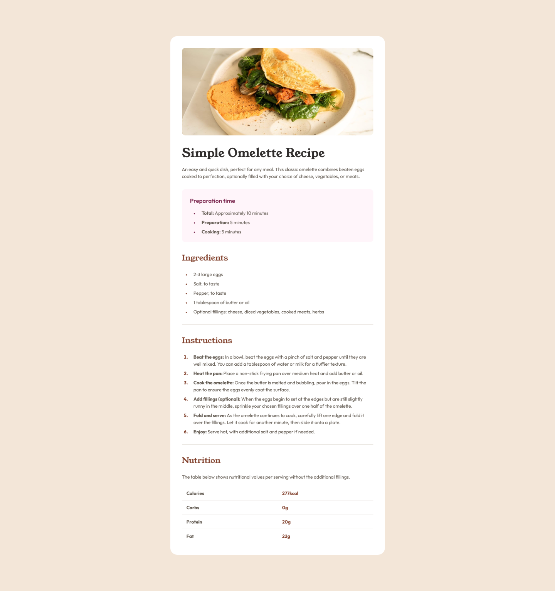

# Frontend Mentor - Recipe page solution

This is a solution to the [Recipe page challenge on Frontend Mentor](https://www.frontendmentor.io/challenges/recipe-page-KiTsR8QQKm).

## Table of contents

- [Overview](#overview)
  - [The challenge](#the-challenge)
  - [Screenshot](#screenshot)
  - [Links](#links)
- [My process](#my-process)
  - [Built with](#built-with)
  - [What I learned](#what-i-learned)
  - [Continued development](#continued-development)
  - [Useful resources](#useful-resources)
- [Author](#author)
- [Acknowledgments](#acknowledgments)

## Overview

### The challenge

Users should be able to:

- View the optimal layout for the interface depending on their device's screen size
- See hover and focus states for all interactive elements on the page
- Experience a fully accessible layout using semantic HTML structure and logical heading hierarchy

### Screenshot



### Links

- Solution URL: [https://github.com/muchiribytes/recipe-page](https://github.com/muchiribytes/recipe-page)
- Live Site URL: [GitHub Pages Deployment](https://muchiribytes.github.io/recipe-page/)

## My process

### Built with

- Semantic HTML5 markup
- CSS custom properties
- CSS Logical Properties for directional layout resilience
- Flexbox for alignment and centering
- Mobile-first workflow
- Custom `@font-face` local font integration

### What I learned

During this project, I focused on fine-tuning pixel-perfect typography wrapping, list alignment, and using modern CSS logical properties (`margin-block`, `padding-inline`, `text-align: start`).

To get the exact line wrap for the header description on mobile screens without breaking fluidity on desktop, I used `max-width` and `letter-spacing` tweaks scoped specifically to small viewports:

```css
header p {
  margin-block-end: 2rem;
  letter-spacing: -0.015em;
  max-width: 19rem;
}

@media (min-width: 48rem) {
  header p {
    max-width: none;
    letter-spacing: normal;
  }
}
```

I also refined list marker alignment using CSS pseudo-elements and padding to ensure multi-line text stays cleanly indented under custom bullet markers:

```css
.prep-time ul,
section ul,
section ol {
  padding-inline-start: 1.5rem;
}

.prep-time li,
section li {
  padding-inline-start: 1rem;
  margin-block-end: 0.5rem;
}

section ul li::marker {
  color: var(--marker-bullet);
  font-size: 0.8rem;
}
```

### Continued development

In future projects, I plan to:

- Deepen my knowledge of advanced CSS Grid layouts for multi-column article pages.
- Continue implementing web accessibility best practices (ARIA roles, table captions, and screen-reader utilities).
- Expand my mobile-first design workflows to handle ultra-wide screens seamlessly.

### Useful resources

- [MDN Web Docs - CSS Logical Properties](https://developer.mozilla.org/en-US/docs/Web/CSS/Guides/Logical_properties_and_values) - Essential guide for writing internationalized and directional-agnostic CSS.

## Author

- Frontend Mentor - [@muchiribytes](https://www.frontendmentor.io/profile/muchiribytes)
- Twitter - [@muchiribytes](https://x.com/muchiribytes)

## Acknowledgments

Thanks to Frontend Mentor for providing realistic design challenges and specifications that bridge the gap between design and front-end code implementation.
